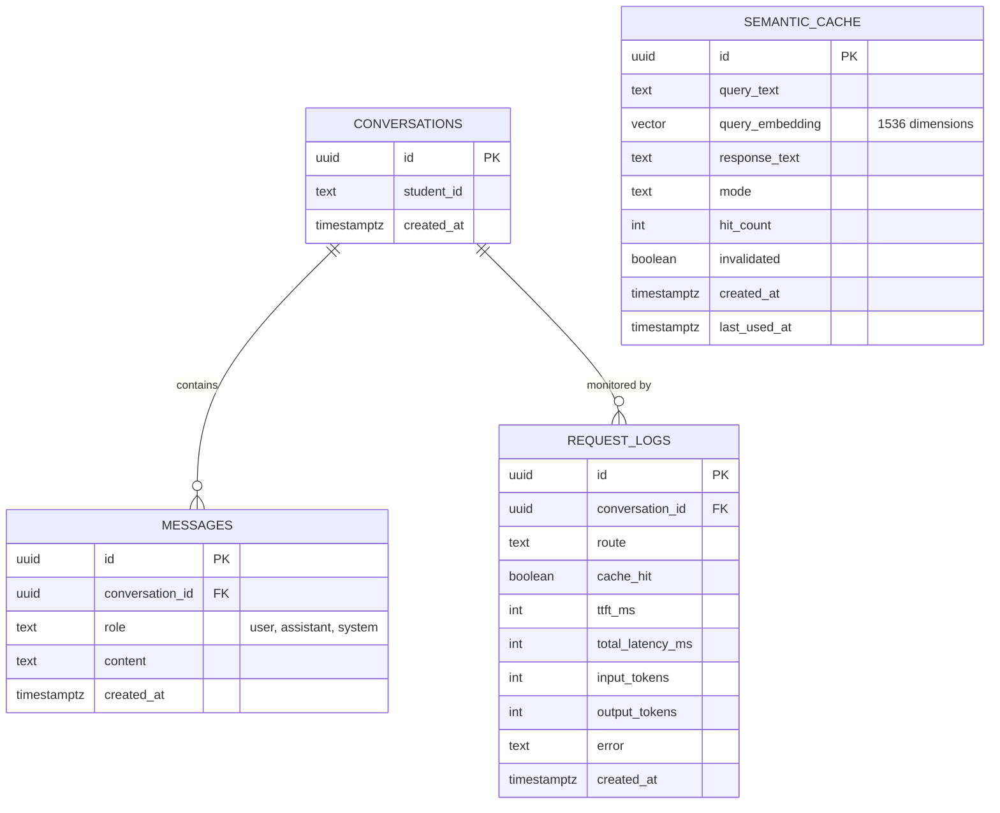

```mermaid
erDiagram
    CONVERSATIONS ||--o{ MESSAGES : "contains"
    CONVERSATIONS ||--o{ REQUEST_LOGS : "monitored by"
    
    CONVERSATIONS {
        uuid id PK
        text student_id
        timestamptz created_at
    }
    
    MESSAGES {
        uuid id PK
        uuid conversation_id FK
        text role "user, assistant, system"
        text content
        timestamptz created_at
    }
    
    SEMANTIC_CACHE {
        uuid id PK
        text query_text
        vector query_embedding "1536 dimensions"
        text response_text
        text mode
        int hit_count
        boolean invalidated
        timestamptz created_at
        timestamptz last_used_at
    }
    
    REQUEST_LOGS {
        uuid id PK
        uuid conversation_id FK
        text route
        boolean cache_hit
        int ttft_ms
        int total_latency_ms
        int input_tokens
        int output_tokens
        text error
        timestamptz created_at
    }
```